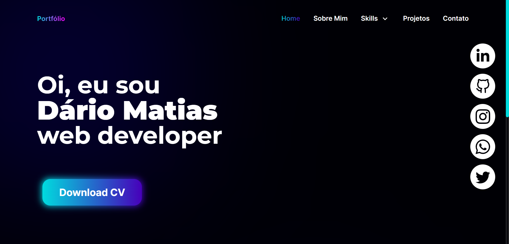
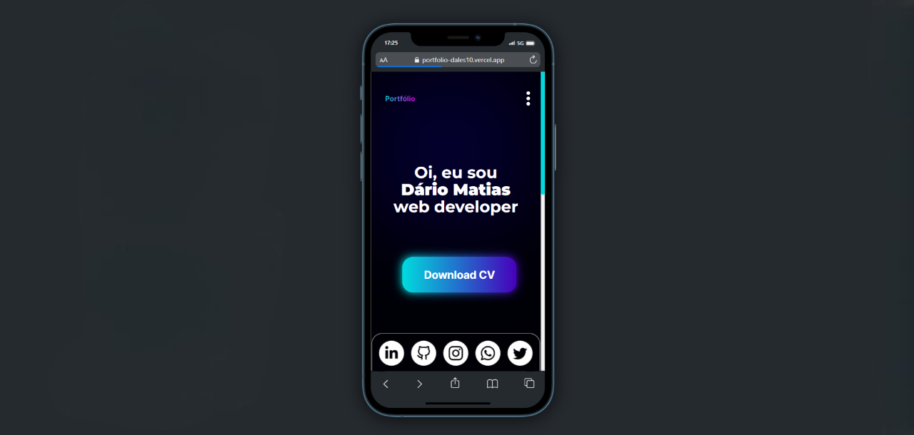

# Portfólio

  
  

## Projeto

### O que irá encontrar em cada página:

• Home - página principal do portfólio, onde poderá fazer o download do meu currículo.

• Sobre mim - nessa página encontrará uma breve explicação de quem sou.

• Skills - decidi dividir as skills em Soft Skills e Hard Skills para poder explicar e exemplificar cada uma adequadamente, concluindo com uma mensagem a respeito das skills.

• Projetos - nessa página estará os meus principais projetos criados até então.

• Contato - caso queira, poderá enviar-me um e-mail com a proposta que tiver.

## Link de acesso
Veja esse projeto em execução: [demo](https://portfolio-dales10.vercel.app/).

## Screenshots
<h3>Desktop</h3>

<h3>Mobile</h3>

## 🛠 Tecnologias

As seguintes ferramentas foram usadas na construção desse projeto:

- [TypeScript](https://www.typescriptlang.org/)
- [Next.js](https://nextjs.org/)
- [TailwindCSS](https://tailwindcss.com/)
- [SASS](https://sass-lang.com/)
- [Firebase](https://firebase.google.com/)
- [React hook form](https://react-hook-form.com/api/useform/)
- [Swiper](https://swiperjs.com/)

 

## Autor

  <b>Dário Matias</b>

 
  Entre em contato!
 
 

